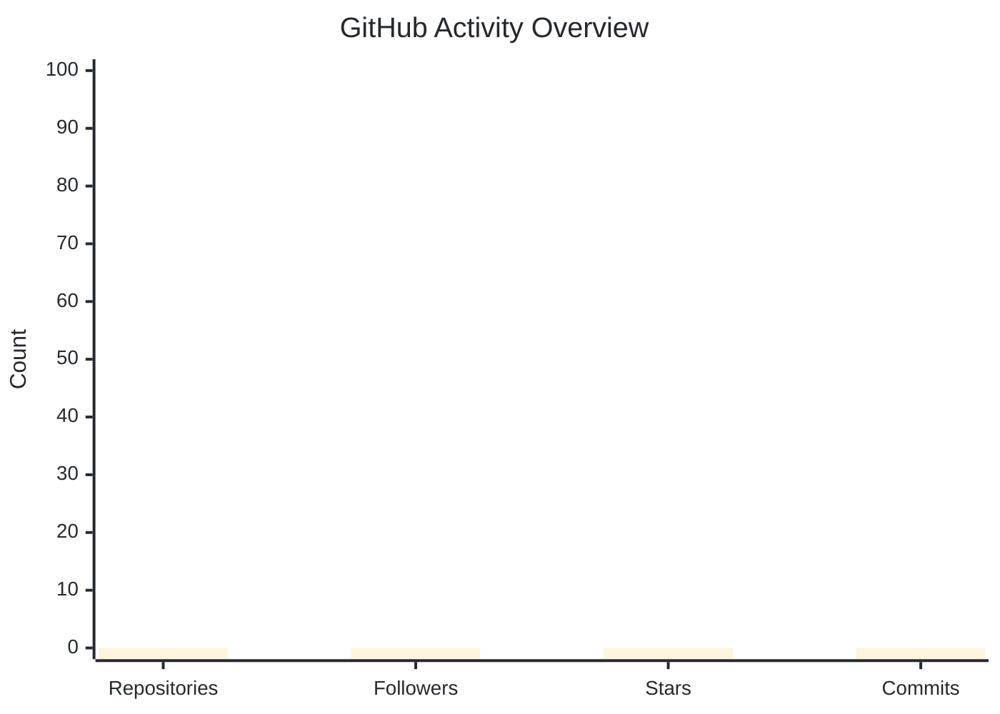
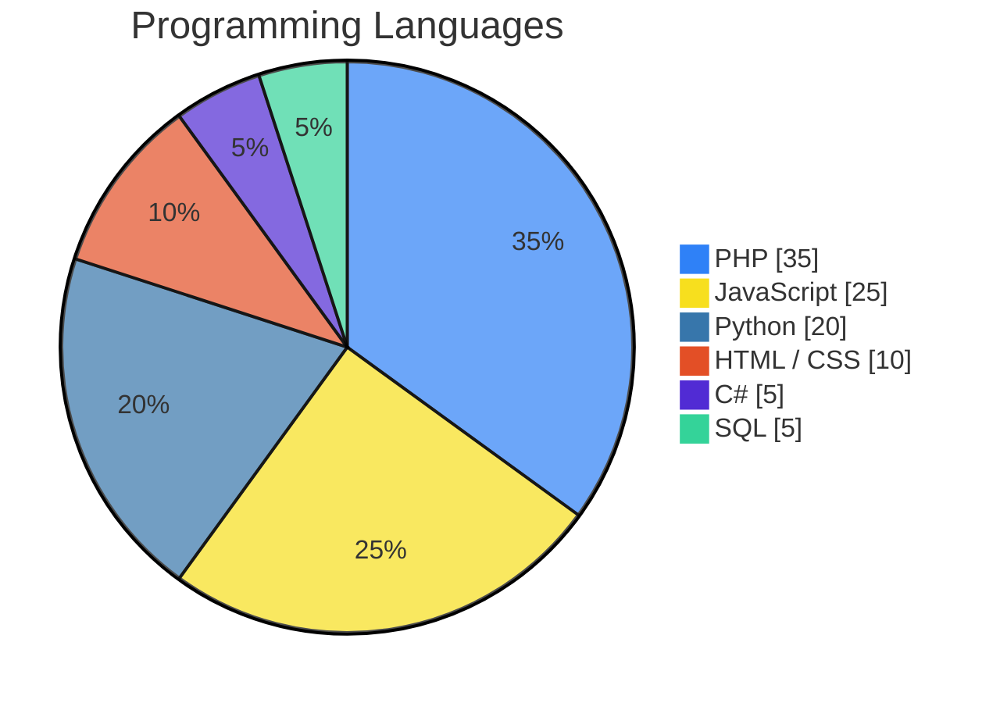
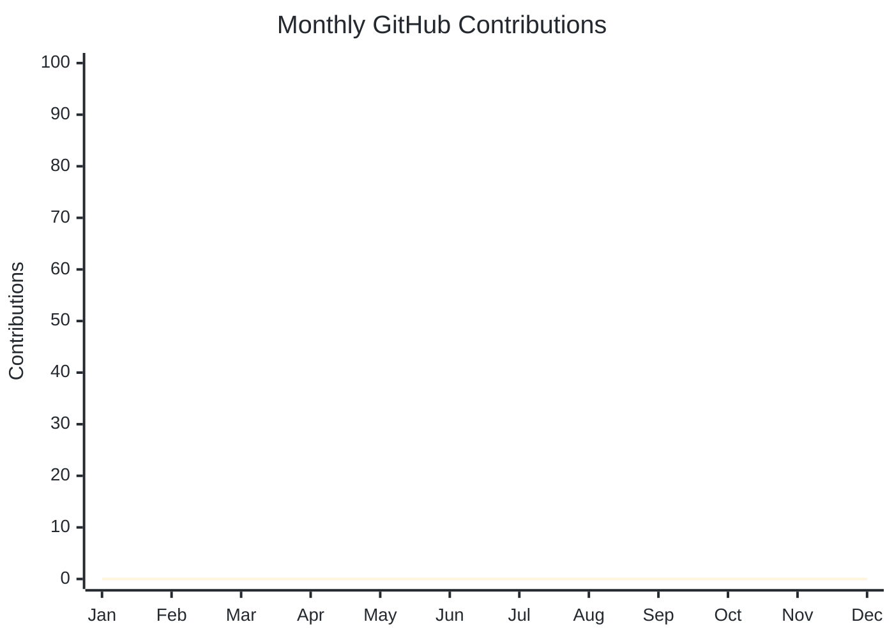

<!-- ========================================================= -->

<!--                    PROFILE HEADER                         -->

<!-- ========================================================= -->

# Hello, folks! 

My name is **Mohamed Ait Abdellah Ou Ali** and I'm a **Web Developer / Software Developer**.

<p align="center">
  
</p>

<h3 align="center">
  
  
  
  
</h3>

---

## A little bit about me

💻 I'm a **Web Developer** passionate about creating modern and responsive websites.
🌐 I develop **web applications** with modern and user-friendly interfaces.
🖥️ I also develop **desktop applications** using Python and C#.
🗄️ I work with **SQL databases**, including MySQL and SQLite.
🤖 I'm also an **AI Content Creator** interested in creating digital content with Artificial Intelligence.
🎬 I create AI-powered images, videos and creative digital content.
🌱 I'm continuously learning new technologies and improving my development skills.
🚀 I enjoy turning ideas into real and functional digital projects.
💡 My goal is to combine **programming, creativity and Artificial Intelligence**.

---

## 🔧 Technologies & Tools


---

## My Development Skills

### Web Development

<p align="center">
  
</p>

### Backend & Databases

<p align="center">
  
</p>

### Programming & Desktop Application Development

<p align="center">
  
</p>

---

## What I Build

🌐 **Websites**

I create modern, responsive and user-friendly websites for personal and business projects.

💻 **Web Applications**

I develop interactive web applications with dynamic interfaces, databases and management features.

🖥️ **Desktop Applications**

I build desktop applications using Python and C# with graphical user interfaces and database integration.

🗄️ **Database Applications**

I work with SQL, MySQL and SQLite to store, manage and organize application data.

🤖 **AI Content**

I create digital content using Artificial Intelligence, including images, videos and creative content for digital platforms.

---

## Latest Projects

<!-- PROJECTS:START -->

* 🌐 **Web Development Projects** — Modern and responsive websites.
* 💻 **Web Applications** — Interactive applications with databases and management systems.
* 🖥️ **Desktop Applications** — Applications developed with Python and C#.
* 🗄️ **Database Projects** — Projects using SQL, MySQL and SQLite.
* 🤖 **AI Content Projects** — Creative projects using Artificial Intelligence for digital content.
* 🎬 **AI Video & Image Content** — AI-powered visual content and creative experiments.

<!-- PROJECTS:END -->

---

## 📊 GitHub Statistics

<p align="center">
  
</p>

### 📊 Activity Overview

<p align="center">
  
</p>



> Replace the values above with your real GitHub statistics.

---

### 🥧 Programming Languages

<p align="center">
  
</p>



> These values are examples. Replace them with values corresponding to your repositories.

---

### 📈 Contributions Over Time

<p align="center">
  
</p>



> Replace the monthly values with your actual GitHub contribution counts.

---

<p align="center">
  
</p>

---

## Technologies I Use

<p align="center">
  
</p>

---

## My Focus

🌐 Web Development
💻 Web Applications
🖥️ Desktop Applications
🗄️ SQL Databases
🤖 Artificial Intelligence
🎬 AI Content Creation
📚 Continuous Learning

---

## Links

<p align="center">

  <a href="YOUR_PORTFOLIO_URL">
    
  </a>

  <a href="https://github.com/YOUR_USERNAME">
    
  </a>

  <a href="YOUR_LINKEDIN_URL">
    
  </a>

  <a href="YOUR_INSTAGRAM_URL">
    
  </a>

  <a href="YOUR_TIKTOK_URL">
    
  </a>

  <a href="YOUR_YOUTUBE_URL">
    
  </a>

  <a href="mailto:YOUR_EMAIL">
    
  </a>

</p>

---

## GitHub Activity

<p align="center">
  
</p>

```mermaid
%%{init: {
  "theme": "base",
  "themeVariables": {
    "fontFamily": "Arial",
    "primaryTextColor": "#24292F",
    "lineColor": "#2F81F7",
    "textColor": "#24292F",
    "background": "#FFFFFF"
  }
}}%%

xychart-beta
    title "GitHub Activity"
    x-axis ["Week 1", "Week 2", "Week 3", "Week 4"]
    y-axis "Activity" 0 --> 100
    line [0, 0, 0, 0]
```

---

<p align="center">
  
</p>
