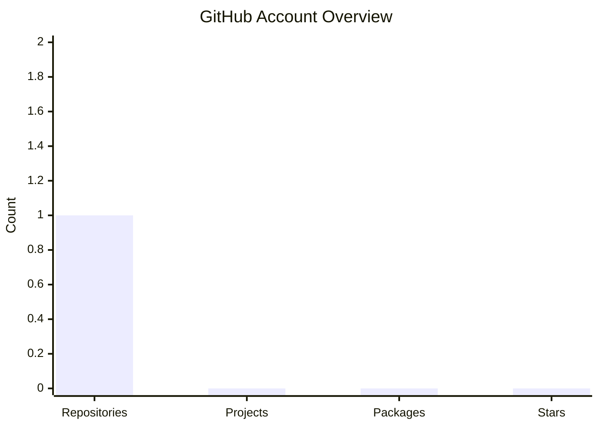
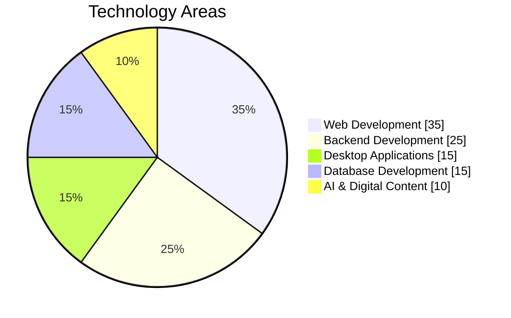
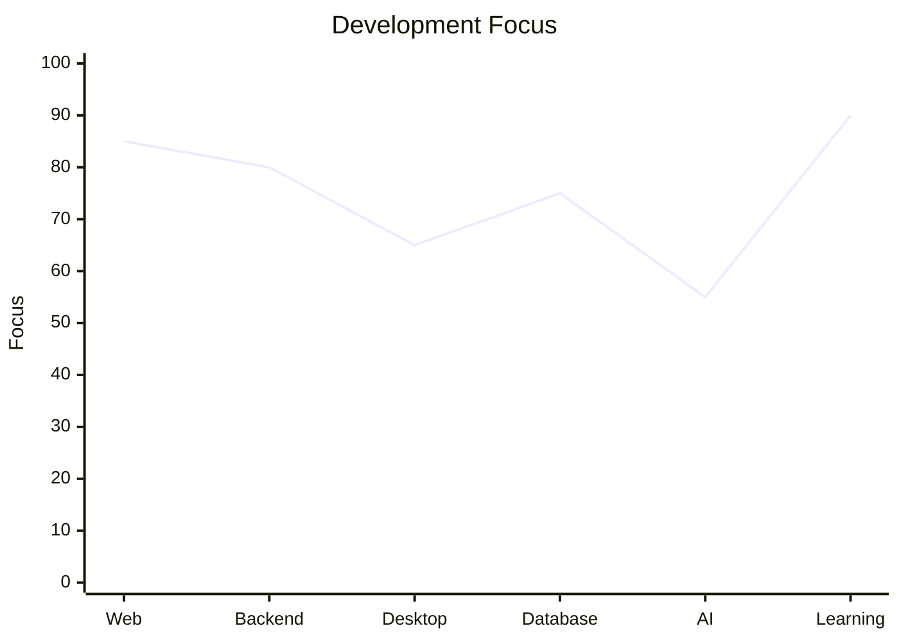

# Hello, folks! 

My name is **Mohamed Ait Abdellah Ou Ali** and I'm a **Web Developer / Software Developer**.

  

  
  
  
  

---

## A little bit about me

💻 I'm a **Web Developer** passionate about creating modern and responsive websites.
🌐 I develop **web applications** with modern and user-friendly interfaces.
🖥️ I also develop **desktop applications** using Python and C#.
🗄️ I work with **SQL databases**, including MySQL and SQLite.
🤖 I'm also interested in **Artificial Intelligence and AI-powered content creation**.
🎬 I create AI-assisted images, videos and creative digital content.
🌱 I'm continuously learning new technologies and improving my development skills.
🚀 I enjoy turning ideas into real and functional digital projects.
💡 My goal is to combine **programming, creativity and Artificial Intelligence**.

---

## 🔧 Technologies & Tools

---

## My Development Skills

### Web Development

  

### Backend & Databases

  

### Programming & Desktop Application Development

  

---

## What I Build

🌐 **Websites**

I create modern, responsive and user-friendly websites for personal and business projects.

💻 **Web Applications**

I develop interactive web applications with dynamic interfaces, databases and management features.

🖥️ **Desktop Applications**

I build desktop applications using Python and C# with graphical user interfaces and database integration.

🗄️ **Database Applications**

I work with SQL, MySQL and SQLite to store, manage and organize application data.

🤖 **AI Content**

I create digital content using Artificial Intelligence, including images, videos and creative content for digital platforms.

---

## Latest Projects

* 🌐 **Web Development Projects** — Modern and responsive websites.
* 💻 **Web Applications** — Interactive applications with databases and management systems.
* 🖥️ **Desktop Applications** — Applications developed with Python and C#.
* 🗄️ **Database Projects** — Projects using SQL, MySQL and SQLite.
* 🤖 **AI Content Projects** — Creative projects using Artificial Intelligence for digital content.
* 🎬 **AI Image & Video Content** — AI-assisted visual and creative experiments.

---

# 📊 GitHub Statistics

  

### 📊 GitHub Account Overview

  

> These are profile-level GitHub metrics and may change as the account grows.

---

### 🥧 Technology Areas

  

> This chart represents the main areas highlighted in my developer profile. It is not an automatic GitHub language statistic.

---

### 📈 Development Focus

  

> This is a visual representation of my current development focus, not a GitHub contribution metric.

---

## Technologies I Use

  

---

## My Focus

  🌐 Web Development &nbsp; • &nbsp;
  💻 Web Applications &nbsp; • &nbsp;
  🖥️ Desktop Applications &nbsp; • &nbsp;
  🗄️ SQL Databases

  🤖 Artificial Intelligence &nbsp; • &nbsp;
  🎬 AI Content Creation &nbsp; • &nbsp;
  📚 Continuous Learning

---

## Links

  

   

  

  

---

  

